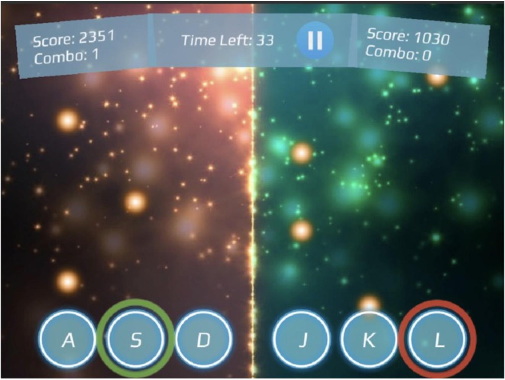

# Mchacks 2019
Won the best interactive multi user application at McHacks 2019 along with a Nintendo Switch prize
https://devpost.com/software/rhythm-flow

# Objective
The objective of the game is to score higher than your opponent. Points are scored if a player triggers a hitbox when a note is in contact with it.

**Points Chart:**  
**Green:** Perfect hit! The hitbox was triggered when a note was in full contact, **full points + combo bonus**  
**Yellow:** Hitbox was triggered when a note was in partial contact, **partial points**  
**Red:** Hitbox was triggered when a note was not in contact, **no points**  
 
**Combo (Bonus Points):**
Combos are achieved when a hitbox triggered **Green** more than once in a row. Combos add a great amount of bonus to your score and progressively increase in value as the pace of the notes progress.

# Controls & Info
**HitBox:** The blue circles at the bottom of each player's half of the screen 
**Notes:** The orange circles that fall from the top of the screen down to the hotboxes 
**Player 1 (Left Side):**  
Key "A": Triggers the left hitbox  
Key "S": Triggers the center hitbox  
Key "D": Triggers the right hitbox  
 
**Player 2 (Right Side):**  
Key "J: Triggers the left hitbox  
Key "K": Triggers the center hitbox  
Key "L": Triggers the right hitbox  

# What's next for Rhythm Flow
1. Support for tablets. The game is very much playable on the computer but the mechanics of it can also be ported to tablets where the touch screen size is sufficient enough to use controls.   
2. More game modes. Currently, there is only one game mode where two people are directly competing against each other. I have ideas for other games modes where instead of competing, two players would have collaborate together to beat the round.